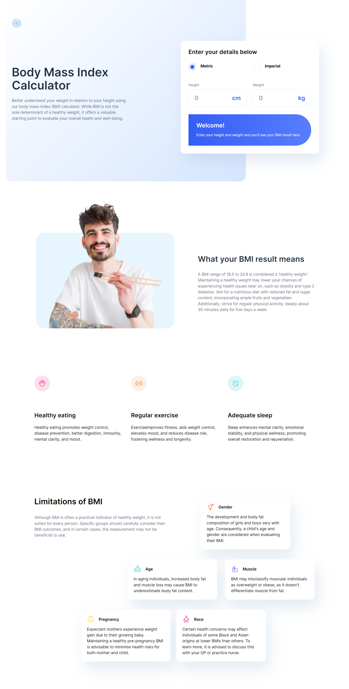

# Frontend Mentor - Body Mass Index Calculator solution

This is a solution to the [Body Mass Index Calculator challenge on Frontend Mentor](https://www.frontendmentor.io/challenges/body-mass-index-calculator-brrBkfSz1T).

## Table of contents

- [Overview](#overview)
  - [The challenge](#the-challenge)
  - [Screenshot](#screenshot)
  - [Links](#links)
- [My process](#my-process)
  - [Built with](#built-with)
  - [What I learned](#what-i-learned)
  - [Continued development](#continued-development)
- [Acknowledgments](#acknowledgments)

## Overview

### The challenge

Users should be able to:

- Select whether they want to use metric or imperial units
- Enter their height and weight
- See their BMI result, with their weight classification and healthy weight range
- View the optimal layout for the interface depending on their device's screen size
- See hover and focus states for all interactive elements on the page

### Screenshot

### Links

- Solution URL: [https://www.frontendmentor.io/solutions/body-mass-index-calculator-3i2cX388K4/](Solution link)
- Live Site URL: [https://bmi-calculator-blond.vercel.app/](Demos)

## My process

### Built with

- Semantic HTML5 markup
- CSS custom properties
- Flexbox
- CSS Grid
- Mobile-first workflow
- [React](https://reactjs.org/) - JS library
- [Next.js](https://nextjs.org/) - React framework
- [Tailwind-CSS](https://tailwindcss.com/) - For styles

### What I learned

- Build responsive website using mobile-first workflow
- Calculate the BMI(Body Mass Index) in imperial and metric
- Learn Deploying to Vercel

### Continued development

- I just make responsive website for fixed resolution, I want to make the website responsive for various screen sizes and devices
- I can not make the radio buttons like the Figma, so I replace the buttons with images, so I do not have hover for it

## Acknowledgments

If you have any feedbacks, please let me know. Your feedback will help me improve my solution.
